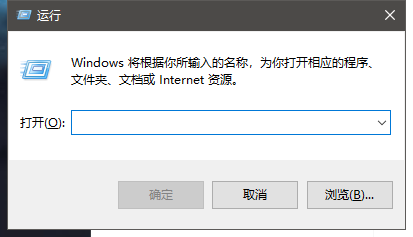
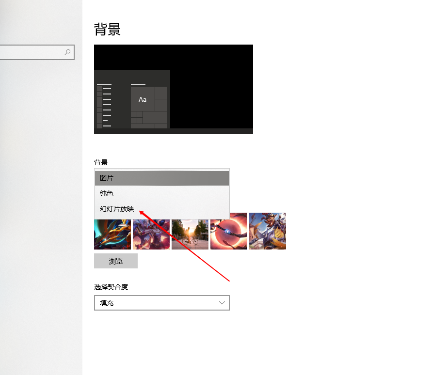
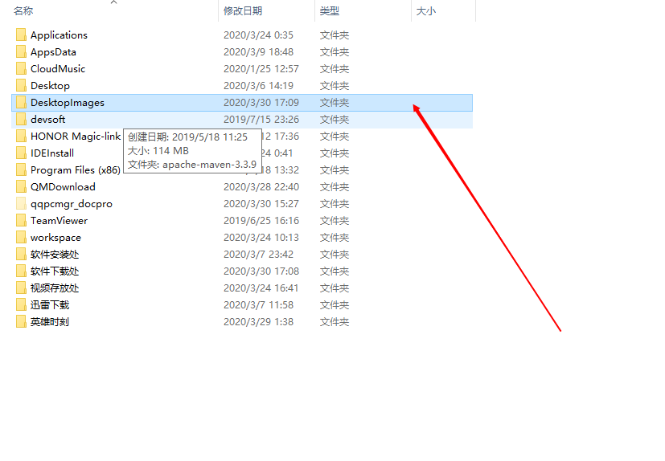
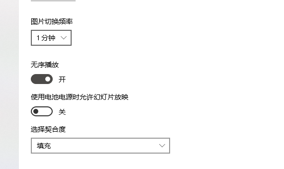

# 自动换壁纸过程

- win+r打开运行
  - 

- 输入```shell:startup```,打开启动文件夹，这里是开机启动，放在这里的话每次开机都会运行一次

- 运行一遍getImage.exe,此时 在D盘会生成一个文件夹DesktopImages这个是 存放图片的文件夹
- 右键--个性化--将背景改为幻灯片放映模式
  - 

- 点击浏览，找到我们在D盘下存图片的文件夹，选中即可
  - 
  - 

- 其他设置，弄好就完成了
  - 

